# 🐱 Automatic Cat Feeder

Modular automatic cat feeder based on an ESP32 microcontroller, a NEMA 17 stepper motor, closed-loop weight feedback, scheduled feeding, and local user interaction through a TFT touch display.

The goal of this project is to design and build a low-cost mechatronic prototype capable of dispensing controlled portions of dry cat food at scheduled times. The system combines mechanical design, 3D printing, electronics, embedded firmware, sensor calibration, and power management.

---

## 📌 Project Overview

Automatic cat feeders are useful embedded systems because they combine several engineering areas in a single functional product:

* Mechanical food storage and dispensing.
* Stepper motor actuation.
* Weight-based portion control.
* Real-time scheduling.
* Sensor integration.
* Local user interface.
* Power supply and backup operation.

This prototype uses an auger screw mechanism driven by a NEMA 17 stepper motor. The amount of food dispensed is measured using a load cell and an HX711 amplifier, allowing the system to stop the motor when the target portion has been reached.

---

## 🎥 Commercial Video

Click the image above to watch the commercial video of the Automatic Cat Feeder prototype.

---

## 🎯 Main Features

* Scheduled automatic feeding.
* Manual food dispensing.
* Closed-loop portion control using a load cell.
* NEMA 17 stepper motor actuation.
* DRV8825 stepper motor driver.
* ESP32 WROOM-32 control unit.
* DS3231 real-time clock for offline timekeeping.
* DHT22 temperature and humidity monitoring.
* 3.5-inch TFT touch display for local interaction.
* 12 V UPS / battery system for backup power.
* Modular mechanical design with 3D-printed parts.
* Low-cost prototype architecture.

---

## 🧩 System Architecture

The prototype is divided into four main subsystems:

| Subsystem         | Description                                                                                       |
| ----------------- | ------------------------------------------------------------------------------------------------- |
| Mechanical system | Food hopper, main body, auger screw, motor mount, bowl support, and electronics enclosure         |
| Electrical system | ESP32, DRV8825, NEMA 17 motor, HX711, load cell, RTC, DHT22, TFT display, and UPS                 |
| Firmware          | Feeding logic, motor control, sensor reading, scheduling, calibration, and user interface         |
| Validation        | Portion accuracy tests, repeatability tests, scheduled feeding tests, and power consumption tests |

The food is stored in the upper hopper and moves by gravity toward the lower dispensing area. The auger screw moves the food toward the outlet, while the load cell measures the real amount of food dispensed into the bowl.

---

## 🛠️ Mechanical Design

The mechanical structure is designed to be manufactured mainly using FDM 3D printing. The prototype prioritizes low cost, modularity, ease of assembly, and adaptability to different dry food sizes.

### 3D-Printed Parts

| Part                           | Description                              | Recommended Material | Notes                                                  |
| ------------------------------ | ---------------------------------------- | -------------------- | ------------------------------------------------------ |
| Main body                      | Main structural frame of the feeder      | PLA / PETG           | Supports the hopper, motor, electronics, and bowl area |
| Food hopper                    | Stores dry cat food                      | PETG recommended     | Smooth internal walls recommended                      |
| Auger screw / dispensing screw | Moves food from the hopper to the outlet | PETG recommended     | Must be tested with the real kibble size               |
| Bowl support                   | Holds the bowl and load cell system      | PLA / PETG           | Should avoid unwanted movement during weighing         |
| Motor mount                    | Holds the NEMA 17 motor in position      | PETG / ABS           | Must keep the motor aligned with the dispensing screw  |
| Electronics cover              | Protects the electronics and wiring      | PLA / PETG           | Ventilation openings recommended                       |

---

## 🧾 Mechanical and Hardware Parts

The mechanical structure of the feeder is based mainly on 3D-printed parts and standard assembly hardware. The final dimensions and quantities may vary depending on the selected enclosure, hopper size, and screw mechanism.

| Image                                                  | Part                  | Description                               |    Quantity | Notes                                         |
| ------------------------------------------------------ | --------------------- | ----------------------------------------- | ----------: | --------------------------------------------- |
|            | M4 screws             | General assembly screws                   |   10–20 pcs | Final length depends on the 3D-printed parts  |
| 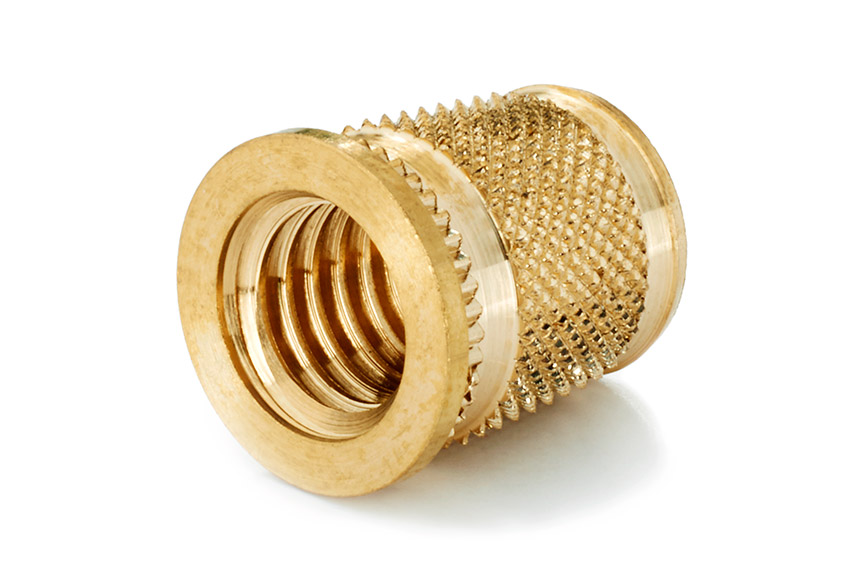   | Threaded inserts      | Metal inserts for stronger screw mounting |    Optional | Recommended for repeated disassembly          |
| 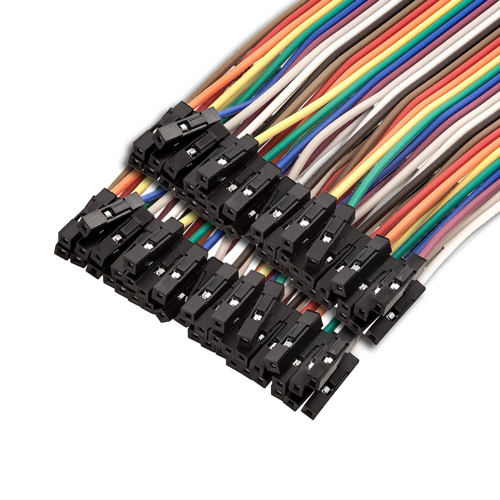              | Wires / jumper cables | Electrical connections                    | As required | Use suitable wire gauge for motor power lines |
|  | Heat-shrink tubing    | Wire insulation and protection            | As required | Recommended for safer wiring                  |

---

## ⚡ Electronic Components

The electrical architecture is built around the ESP32 WROOM-32 microcontroller. The ESP32 controls the actuator, reads the sensors, manages the feeding schedule, and communicates with the local user interface.

| Image                                                        | Component                      | Quantity | Description                                 | Purpose                                             |
| ------------------------------------------------------------ | ------------------------------ | -------: | ------------------------------------------- | --------------------------------------------------- |
| 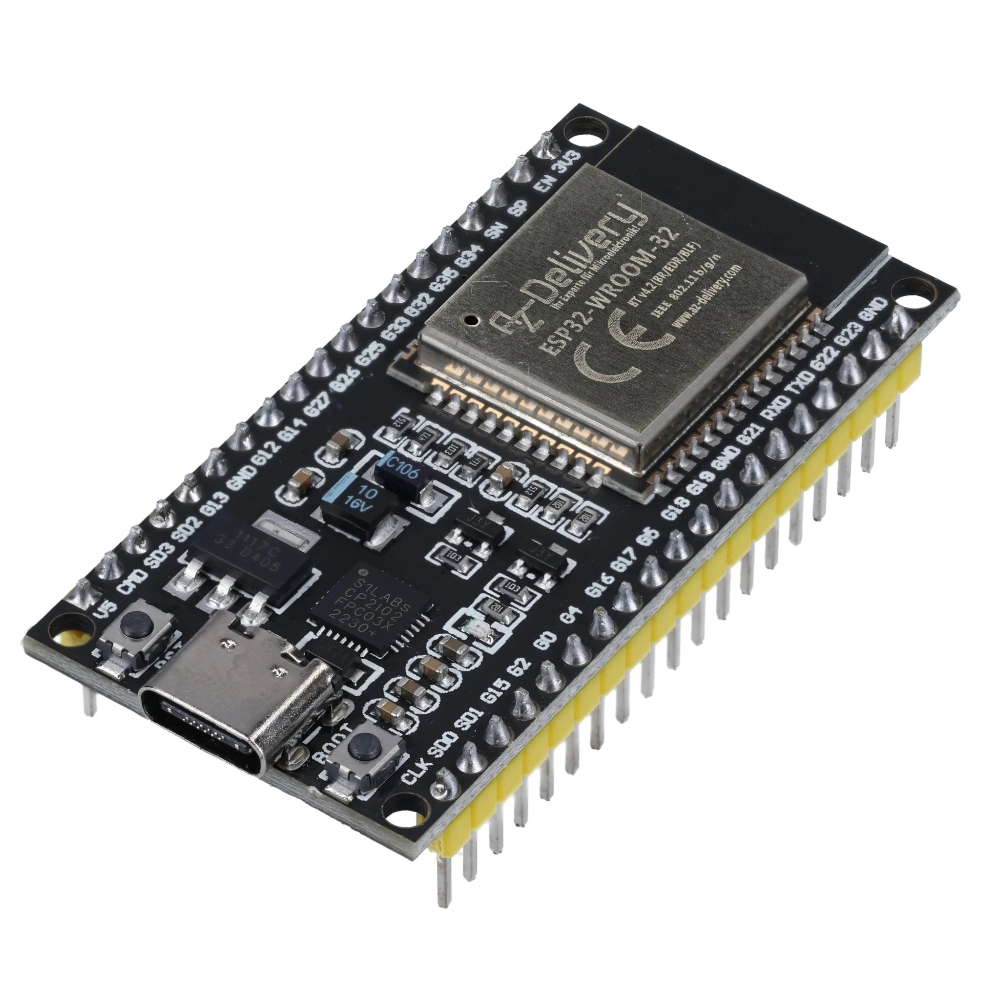           | ESP32 WROOM-32                 |        1 | Wi-Fi and Bluetooth capable microcontroller | Main control unit                                   |
| 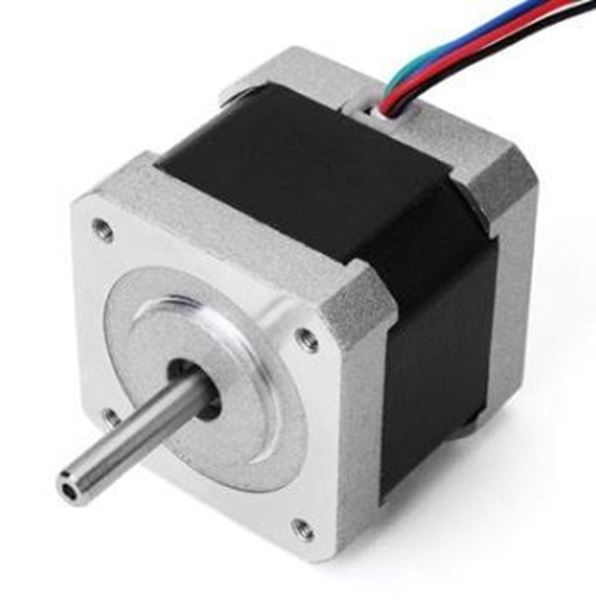     | NEMA 17 stepper motor          |        1 | Bipolar stepper motor                       | Rotates the dispensing mechanism                    |
| 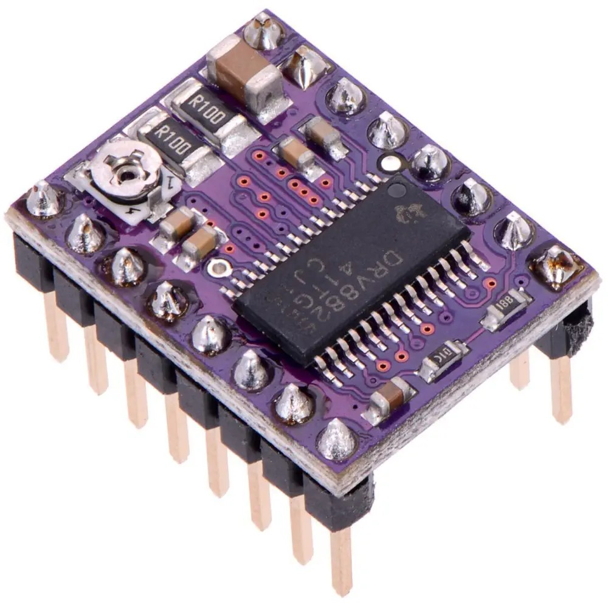           | DRV8825 stepper motor driver   |        1 | Stepper motor driver module                 | Drives the NEMA 17 motor from ESP32 control signals |
| 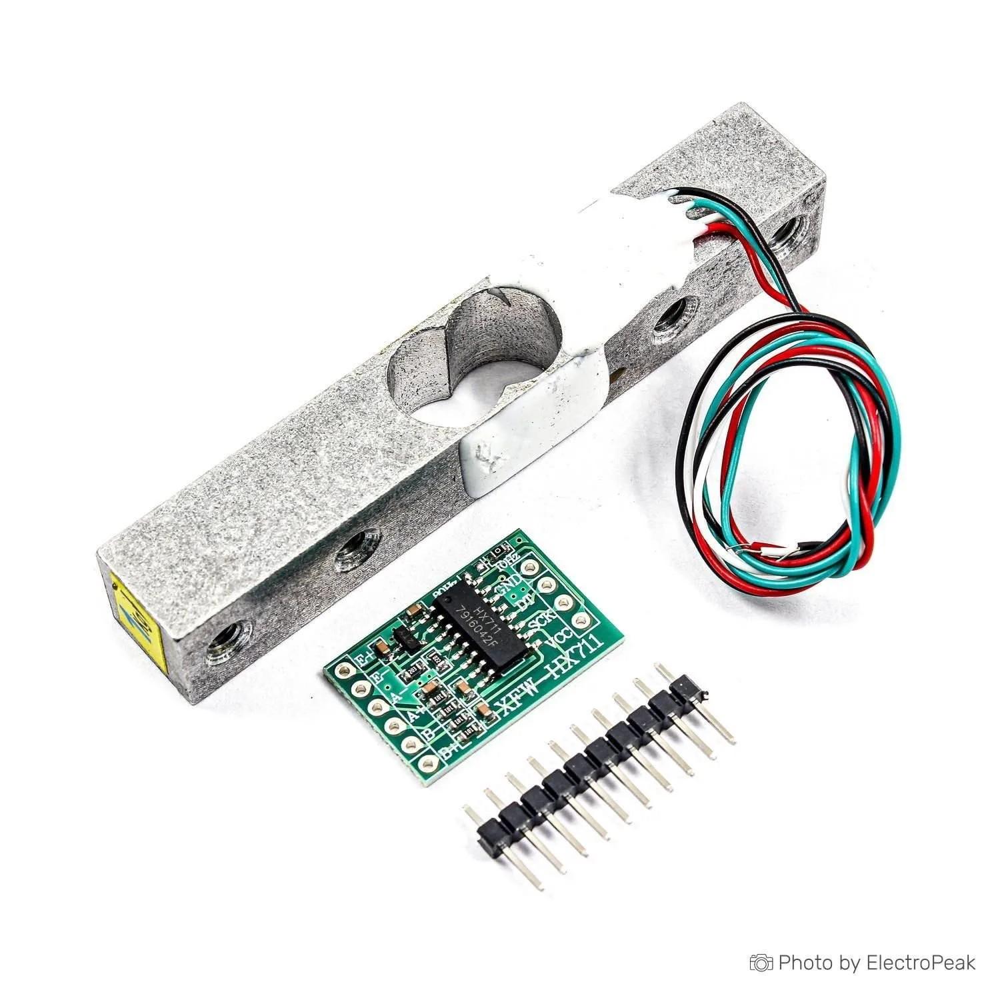          | Load cell 1 kg + HX711         |        1 | Weight sensor and 24-bit ADC amplifier      | Measures the dispensed food portion                 |
| 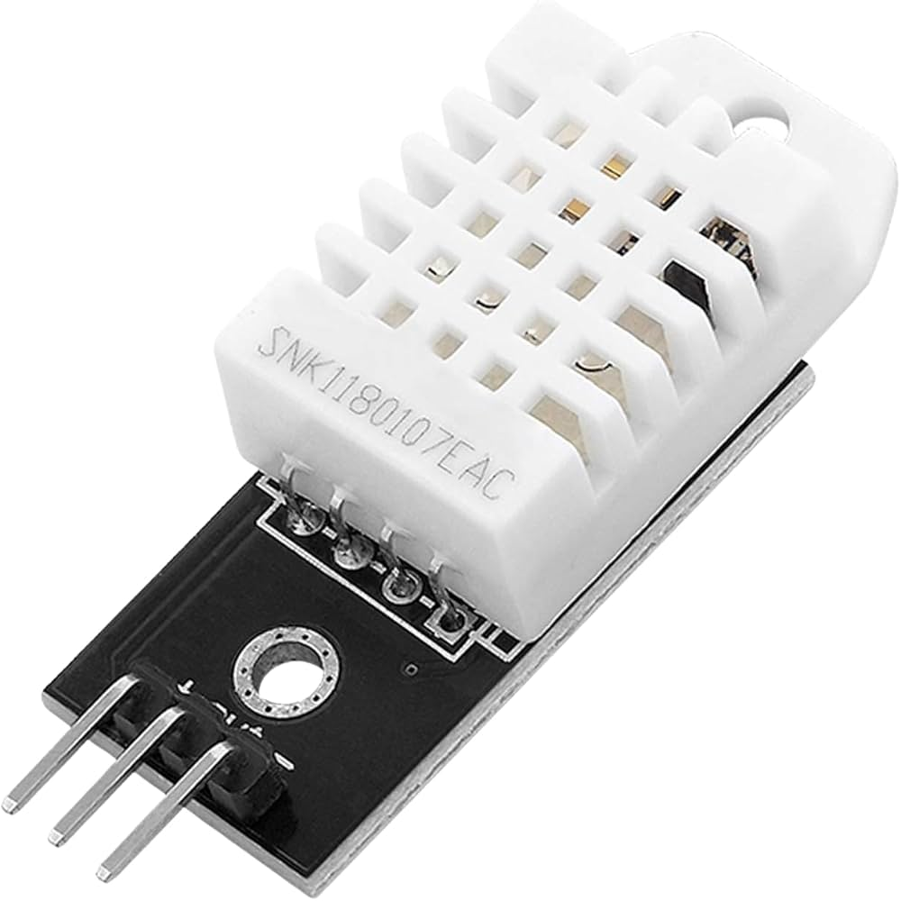             | DHT22                          |        1 | Temperature and humidity sensor             | Monitors food storage conditions                    |
| 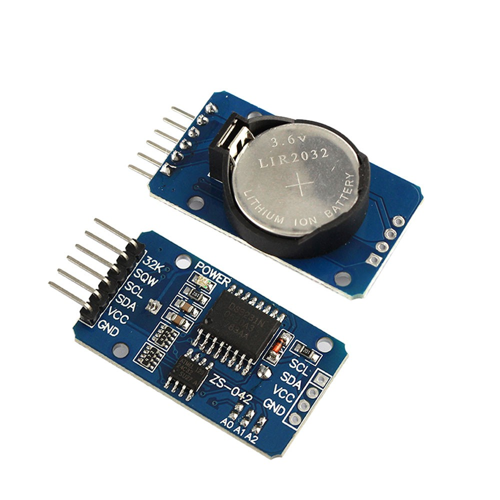               | RTC DS3231                     |        1 | Real-time clock module                      | Keeps accurate feeding schedules without Wi-Fi      |
| 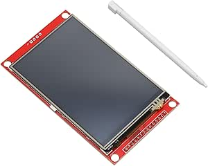 | 3.5-inch TFT touch display     |        1 | Local touchscreen interface                 | Displays information and allows local configuration |
| 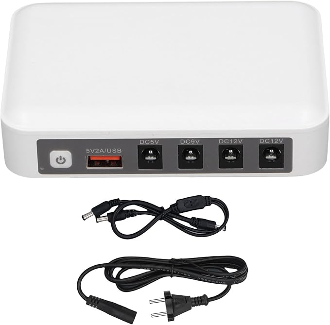         | 12 V Mini UPS / battery system |        1 | Backup power supply                         | Keeps the feeder powered during short outages       |
| 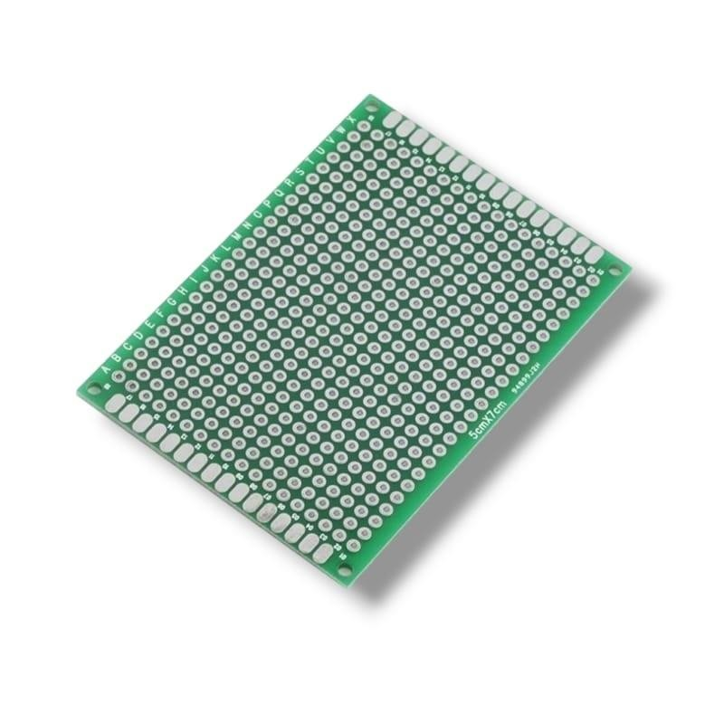            | Universal double-sided PCB     |        1 | Prototyping PCB                             | Used for mounting and organizing the circuit        |

---

## 🔌 Power Architecture

The system uses three voltage levels:

| Voltage Rail | Usage                                              |
| ------------ | -------------------------------------------------- |
| 12 V         | NEMA 17 stepper motor through the DRV8825 driver   |
| 5 V          | ESP32 development board and selected modules       |
| 3.3 V        | ESP32 logic level and compatible low-power modules |

All voltage rails must share a common ground reference. This is required to ensure that control signals and sensor communication lines are interpreted correctly.

> ⚠️ The DRV8825 current limit must be adjusted according to the rated current of the selected NEMA 17 motor. A bulk capacitor should also be placed close to the motor power input of the driver to reduce voltage spikes generated by the inductive load.

---

## 🧠 ESP32 GPIO Mapping

| Target Component | Peripheral Pin | ESP32 GPIO | Description                   |
| ---------------- | -------------- | ---------: | ----------------------------- |
| DRV8825          | STEP           |    GPIO 26 | Step pulse output             |
| DRV8825          | DIR            |    GPIO 27 | Direction control             |
| DRV8825          | ENABLE         |    GPIO 14 | Driver enable / power saving  |
| HX711            | DOUT           |    GPIO 32 | Load cell data                |
| HX711            | PD_SCK         |    GPIO 33 | Load cell clock               |
| DS3231 RTC       | SDA            |    GPIO 21 | I2C data                      |
| DS3231 RTC       | SCL            |    GPIO 22 | I2C clock                     |
| DHT22            | DATA           |     GPIO 4 | Temperature and humidity data |
| TFT Display      | SPI_CLK        |    GPIO 18 | SPI clock                     |
| TFT Display      | SPI_MISO       |    GPIO 19 | SPI MISO                      |
| TFT Display      | SPI_MOSI       |    GPIO 23 | SPI MOSI                      |
| TFT Display      | TFT_CS         |    GPIO 15 | Display chip select           |
| TFT Display      | TFT_DC         |     GPIO 2 | Data / command selection      |

> ⚠️ Some ESP32 pins are strapping pins and can affect boot behaviour. GPIO 0, GPIO 2, GPIO 5, GPIO 12, and GPIO 15 must be used carefully.

---

## 💻 Firmware

The firmware is developed in C/C++ using the Arduino framework for ESP32.

The software controls:

* Scheduled feeding.
* Manual dispensing.
* Motor movement.
* Load cell readings.
* RTC timekeeping.
* DHT22 environmental readings.
* TFT display interface.
* Basic safety checks.
* Power-saving behaviour.

---

## 🔁 Control Algorithm

The feeding cycle follows this sequence:

1. Read the current time from the DS3231 RTC.
2. Compare the current time with the programmed feeding schedule.
3. If a feeding event is required, enable the DRV8825 driver.
4. Start rotating the NEMA 17 motor.
5. Move food through the auger screw.
6. Read the load cell using the HX711 amplifier.
7. Compare the measured weight with the target portion.
8. Stop the motor when the desired portion is reached.
9. Disable the motor driver to reduce power consumption.
10. Store or display the feeding result.

---

## ⚖️ Calibration

Calibration is required before using the feeder.

### Load Cell Calibration

The load cell must be calibrated using known reference weights.

Recommended process:

1. Place the empty bowl on the load cell.
2. Tare the system.
3. Place a known weight on the bowl.
4. Read the raw HX711 value.
5. Calculate the scale factor.
6. Repeat the process with different weights.
7. Store the final calibration factor in the firmware configuration.

### Portion Calibration

Different dry foods have different shapes and densities. For this reason, the dispensing system must be tested with the real kibble.

Recommended process:

1. Set a target portion, for example 20 g.
2. Run the dispensing cycle.
3. Measure the real dispensed mass.
4. Repeat several times.
5. Calculate the average error.
6. Adjust motor speed, acceleration, or stopping threshold if required.

---

## 🧪 Validation Tests

| Test                      | Objective                                    | Expected Result                      |
| ------------------------- | -------------------------------------------- | ------------------------------------ |
| Dispensing mechanism test | Verify food movement through the auger screw | Food is dispensed without blockage   |
| Portion accuracy test     | Compare target mass with real mass           | Low dispensing error                 |
| Repeatability test        | Repeat the same portion several times        | Similar mass between cycles          |
| Scheduled feeding test    | Verify RTC-based activation                  | Feeder activates at programmed times |
| Power consumption test    | Measure 12 V and 5 V consumption             | Consumption within estimated range   |

---

## 📊 Technical Targets

| Parameter                          | Target / Estimated Value |
| ---------------------------------- | -----------------------: |
| Food capacity                      |       Approximately 3 kg |
| Estimated autonomy                 |  Approximately 45.6 days |
| Daily food quantity                | Approximately 65.8 g/day |
| Required motor torque              |                0.199 N·m |
| Selected motor torque              |                  0.4 N·m |
| Safety factor                      |                     2.01 |
| Estimated daily energy consumption |            0.73–2 Wh/day |

---

## 🧮 Prototype Material Cost

| Item | Component                                       | Quantity | Unit Price [€] |   Cost [€] | Provider  |
| ---: | ----------------------------------------------- | -------: | -------------: | ---------: | --------- |
|    1 | NEMA 17 stepper motor                           |        1 |          14.00 |      14.00 | Amazon    |
|    2 | ESP32 WROOM-32                                  |        1 |          13.00 |      13.00 | Amazon    |
|    3 | Load Cell 1 kg + HX711                          |        1 |          20.00 |      20.00 | Amazon    |
|    4 | DHT22 temperature and humidity sensor           |        1 |           9.99 |       9.99 | Robotshop |
|    5 | PLA 1 kg                                        |        1 |          13.00 |      13.00 | Amazon    |
|    6 | Universal double-sided PCB, 9 x 15 cm, 10 units |        1 |          10.17 |      10.17 | Amazon    |
|    7 | DRV8825 stepper motor driver                    |        1 |          19.24 |      19.24 | Robotshop |
|    8 | RTC DS3231                                      |        1 |           4.50 |       4.50 | Amazon    |
|    9 | SAI Mini UPS 6000 mAh                           |        1 |          39.90 |      39.90 | Amazon    |
|   10 | 3.5-inch LCD TFT touch display                  |        1 |          16.14 |      16.14 | Amazon    |
|      | **Total material cost**                         |          |                | **159.94** |           |

---

## 🧯 Safety Notes

* Do not power the NEMA 17 motor directly from the ESP32.
* Always use a dedicated stepper motor driver.
* Adjust the DRV8825 current limit before connecting the motor.
* Use a common ground between the ESP32, driver, sensors, and power supply.
* Avoid loose wires near the moving dispensing mechanism.
* Protect the electronics from food dust and humidity.
* Test the system without food before performing real dispensing tests.
* Do not leave the feeder unattended until the prototype has been validated.
* Disconnect the power supply before modifying wiring.
* Check motor and driver temperature during long tests.

---

## 🚀 Future Improvements

* Mobile application integration.
* Remote configuration through a cloud backend.
* Food level detection.
* Improved enclosure design.
* Better humidity protection.
* Long-term reliability testing.
* Advanced calibration procedure.
* Notification system for low food level or failed dispensing.
* AI-assisted feeding analysis based on historical data.
* Improved user interface for feeding schedules and calibration.
* Additional safety detection for mechanical jams.

---

## 👥 Authors

* Ferran Vila Ordeig
* Biel Tomàs Rifà
* Pol Roch Jose
* Georgina Garcia Vilaseca

Degree in Mechatronics Engineering
Subject: Integrated Projects II
University of Vic - Central University of Catalonia

---

## 📄 License

This project is intended for academic and educational purposes.

Add a license file if the project is going to be published publicly.

Recommended licenses:

* MIT License for open-source software.
* CERN Open Hardware Licence for hardware designs.
* Creative Commons license for documentation and 3D models.

---

## 📚 Documentation

The complete technical document includes:

* State of the art and benchmarking.
* Objectives.
* Mechanical design.
* Electrical design.
* Design calculations.
* Control strategy.
* Functional testing plan.
* Cost estimation.
* Conclusions.
* Electrical schematic appendix.

The final report should be stored in the `docs/` folder when available.
