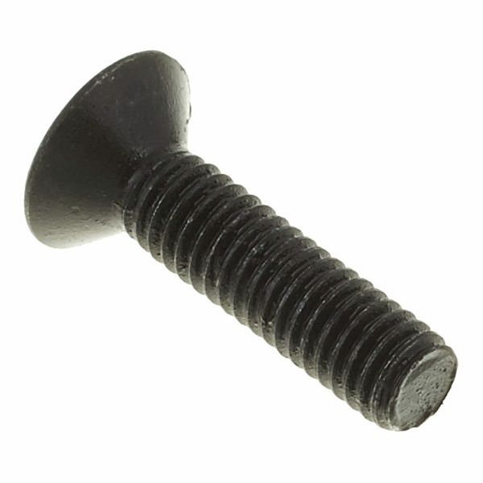
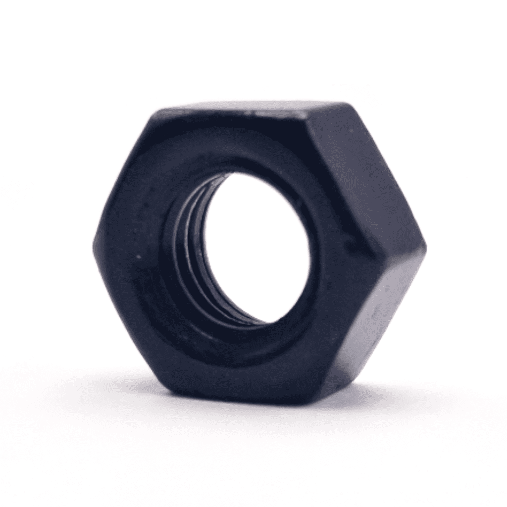

# Automatic Cat Feeder

Modular automatic cat feeder based on Arduino/ESP32, motorized food dispensing, scheduled feeding, and sensor-based portion control.

Automatic cat feeders are useful embedded systems because they combine mechanical design, electronics, firmware, timing control, and safety checks. In order to make the feeder reliable, we need to design a robust food container, a precise dispensing mechanism, safe electronics, and a control algorithm capable of dispensing the correct amount of food at the right time.

This project is an attempt to create a simple, modular, and low-cost automatic cat feeder that can be easily adapted for different motor, sensor, microcontroller, and enclosure combinations.

---

## Demo

YouTube video demo: _coming soon_

---

## README structure

- Mechanical components
  - 3D printed parts
  - Hardware parts
- Electrical components
  - Microcontroller
  - Motor / actuator
  - Motor driver
  - Sensors
  - Power supply
- Arduino code
  - Project structure
  - Control algorithm
  - Feeding schedule
  - Manual dispensing
  - Safety checks
- Calibration
  - Portion size calibration
  - Sensor calibration
- Future improvements

---

# Mechanical components

## 3D printed parts

This automatic cat feeder project can be built using several 3D printed parts. The exact design may vary depending on the selected food container, motor, and dispensing mechanism.

Suggested 3D printed parts:

| Part | Description | Notes |
|---|---|---|
| Main body | Main structure of the feeder | Holds the container and electronics |
| Food hopper | Stores dry cat food | Should be smooth inside to avoid clogging |
| Dispensing wheel / screw | Controls the amount of food dispensed | Can be adapted for different kibble sizes |
| Bowl support | Holds the food bowl in place | Optional but recommended |
| Electronics cover | Protects the microcontroller and wiring | Should allow ventilation |
| Motor mount | Holds the motor in the correct position | Depends on the selected motor |

Recommended printing settings:

| Part | Infill | Layer height | Material |
|---|---:|---:|---|
| Main body | 25–35% | 0.20 mm | PLA / PETG |
| Food hopper | 20–30% | 0.20 mm | PETG recommended |
| Dispensing wheel | 40–60% | 0.12–0.20 mm | PETG recommended |
| Motor mount | 40–60% | 0.15–0.20 mm | PETG / ABS |
| Electronics cover | 20% | 0.20 mm | PLA / PETG |

> **Beware:** The dispensing system must be tested with the real cat food that will be used. Different kibble sizes can cause jams or inaccurate portions.

---

## Hardware parts

| Image | Component | Description | Quantity | Notes |
|---|---|---|---:|---|
|  | M3 screws | General assembly screws | 10–20 pcs | Length depends on printed parts |
|  | M3 nuts | Nuts for mechanical assembly | 10–20 pcs | Optional if using threaded inserts |
|  | Threaded inserts | Metal inserts for stronger screw mounting | Optional | Recommended for repeated disassembly |

---

# Electrical components

This prototype uses the electronic components required to control the automatic dispensing mechanism, display system information, monitor environmental conditions, and keep the feeder powered in case of a power interruption.

## Components used

| Image | Component | Quantity | Description | Purpose |
|---|---|---:|---|---|
|  | ESP32-WROOM-32 | 1 | Wi-Fi and Bluetooth capable microcontroller | Controls the feeder logic, motor driver, sensors, and user interface |
|  | NEMA 17 stepper motor | 1 | Bipolar stepper motor | Rotates the dispensing mechanism |
|  | DRV8825 stepper motor driver | 1 | Stepper motor driver module | Drives the NEMA 17 motor from the ESP32 control signals |
|  | SAI Mini UPS 6000 mAh | 1 | Backup power supply | Keeps the feeder powered also during short power interruptions |
|  | 3.5" LCD TFT Touch Display | 1 | Touchscreen display module | Displays system information and allows user interaction |
|  | DHT22 | 1 | Temperature and humidity sensor | Measures temperature and humidity |

---

# Arduino code

_still not complete_

## Project structure

Suggested code structure:

```text
AutomaticCatFeeder/
├── AutomaticCatFeeder.ino
├── config.h
├── motor_control.cpp
├── motor_control.h
├── sensors.cpp
├── sensors.h
├── feeder_logic.cpp
├── feeder_logic.h
├── time_manager.cpp
└── time_manager.h
Suggested 3D printed parts:

| Part | Description | Notes |
|---|---|---|
| Main body | Main structure of the feeder | Holds the container and electronics |
| Food hopper | Stores dry cat food | Should be smooth inside to avoid clogging |
| Dispensing wheel / screw | Controls the amount of food dispensed | Can be adapted for different kibble sizes |
| Bowl support | Holds the food bowl in place | Optional but recommended |
| Electronics cover | Protects the microcontroller and wiring | Should allow ventilation |
| Motor mount | Holds the motor in the correct position | Depends on the selected motor |

Recommended printing settings:

| Part | Infill | Layer height | Material |
|---|---:|---:|---|
| Main body | 25–35% | 0.20 mm | PLA / PETG |
| Food hopper | 20–30% | 0.20 mm | PETG recommended |
| Dispensing wheel | 40–60% | 0.12–0.20 mm | PETG recommended |
| Motor mount | 40–60% | 0.15–0.20 mm | PETG / ABS |
| Electronics cover | 20% | 0.20 mm | PLA / PETG |

> **Beware:** The dispensing system must be tested with the real cat food that will be used. Different kibble sizes can cause jams or inaccurate portions.

---
